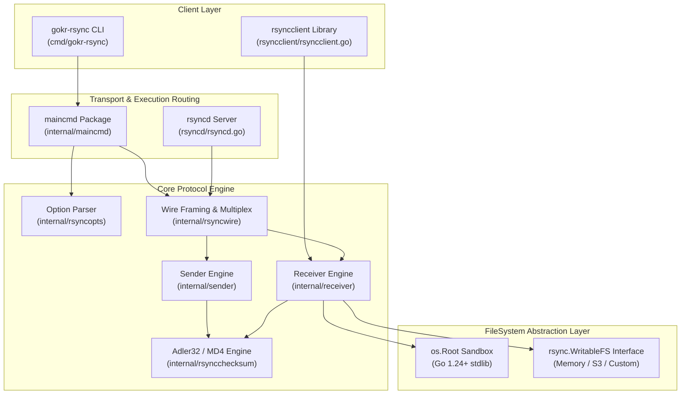
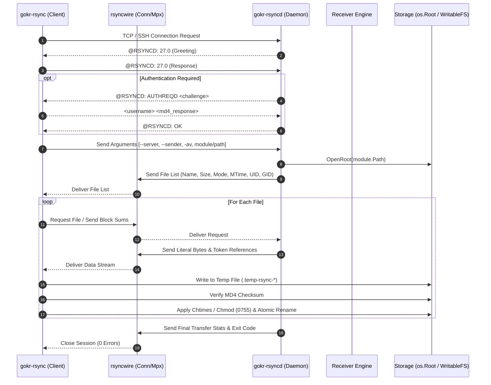
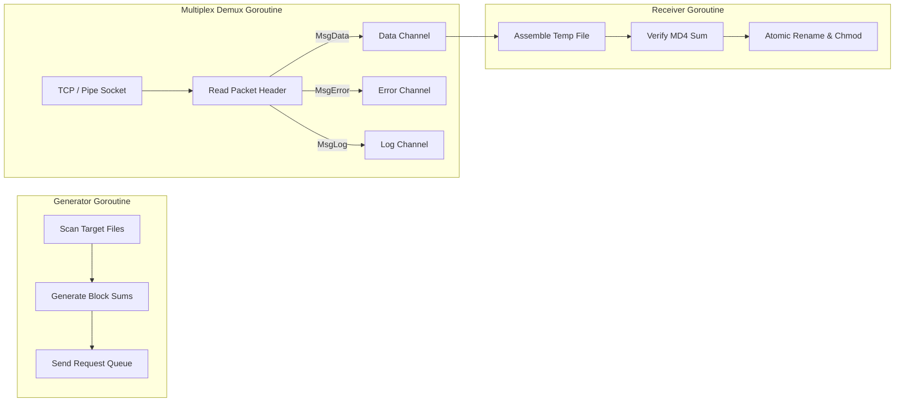
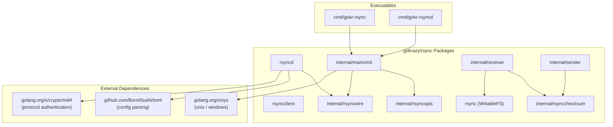
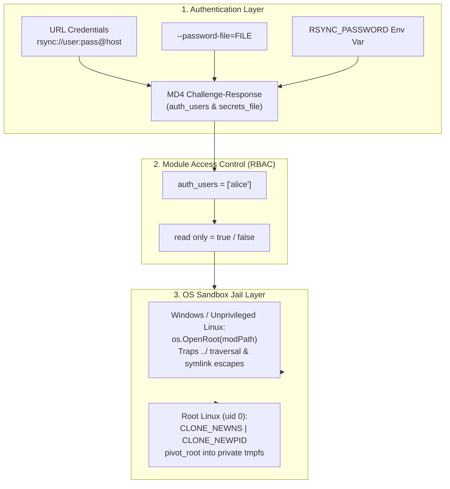

# gokrazy/rsync Architecture Specification (`ARCHITECTURE.md`)

This document defines the architectural specification, data flow logic, concurrency model, package dependency topology, and security model of `gokrazy/rsync`, a pure Go implementation of the `rsync` protocol suite (client, daemon, and embedded library).

---

## 1. Architecture and Design Choices, Assumptions, Edge Cases, Performance & Efficiency

### High-Level Architecture
`gokrazy/rsync` is structured as a decoupled, modular Go engine. The core protocol engine (`rsyncwire`, `sender`, `receiver`, `rsyncopts`) is separated from IO transport wrappers (`maincmd`, `rsyncd`, `rsyncclient`), allowing execution as a standalone CLI binary (`gokr-rsync`), a background daemon (`gokr-rsyncd`), or an embedded library (`rsyncclient`).

### Key Design Choices
1. **Pure Go Rsync Protocol Suite**: Implements rsync protocols 27, 30/31, and 32 natively in Go without C dependencies or shell executions.
2. **FileSystem Abstraction (`rsync.WritableFS`)**: Abstracts file system mutations so targets can write directly to disk via `os.Root` or into pure in-memory, S3, or database backends.
3. **OS-Enforced Jail Isolation**: Utilizes Go 1.24+ `os.OpenRoot` handles on Windows/unprivileged Linux and `pivot_root` mount namespaces under root Linux.
4. **Structured Multiplex Framing**: Demultiplexes out-of-band messages (`MsgErrorXfer`, `MsgInfo`, `MsgWarning`) from inline file binary data cleanly over a single TCP/SSH/TLS stream.
5. **Standard Exit Code Taxonomy**: Returns standard `rsync(1)` exit codes (`0` ok, `1` syntax, `2` protocol, `3` file select, `5` client start, `10` socket IO, `11` file IO, `20` signal) wrapped via `ExitError`.

### Key Assumptions
- Network streams operate over reliable stream connections (TCP socket, TLS session, or SSH pipe).
- Wire protocol defaults to version 27 (`@RSYNCD: 27.0` compatibility) with automatic negotiation up to Protocol 32 (`rsync 3.4.x` / `AlmaLinuxOS-10`).
- Time resolution adheres to Unix timestamp seconds (`mtime`) with 64-bit nanosecond extensions in Protocol 32.

### Edge Cases Handled
- **Unprivileged Windows Symlinks**: If `os.Symlink` fails due to missing `SeCreateSymbolicLinkPrivilege`, errors are caught gracefully without terminating the session.
- **Landlock ACL Named Directories**: Automatically resolves parent paths for sources lacking trailing slashes to prevent `OpenRoot` permission errors under Linux Landlock.
- **Non-Fatal Multiplex Errors**: Treats `MsgErrorXfer` (1) and `MsgWarning` (4) as non-fatal notifications, continuing file list processing.
- **Path Normalization**: Trailing slashes and Windows backslashes (`\`) are normalized to standard forward slashes (`/`) via `filepath.ToSlash()` to prevent wire leakage.
- **Atomic File Staging (`--temp-dir`)**: Incoming files stage in `.temp-rsync-*` handles before being atomically renamed, preventing corrupt target states upon network aborts.

### Performance & Efficiency Optimizations
- **Adler32 + MD4 Block Matching**: Generates rolling Adler32 32-bit checksums to locate candidate blocks in $O(1)$ time, followed by 128-bit MD4 collision verification.
- **Whole-File Bypass (`--whole-file` / `-W`)**: Bypasses rolling checksum generation when local/high-speed transfers are specified.
- **Size-Only Skipping (`--size-only`)**: Bypasses timestamp comparisons when file sizes match.

---

## 2. Data Flow and Control Logic

### Operational Flow
1. **Initialization**: Parse arguments (`internal/rsyncopts`), configure environment (`rsyncos.Env`).
2. **Handshake**: Negotiate protocol version (`27`) and send multiplexing header.
3. **Authentication**: Perform MD4 challenge-response authentication if `auth_users` is specified.
4. **File List Exchange**: Walk directory trees (`internal/sender/flist.go`) applying filter/exclude rules, send file list items with mode/mtime/uid/gid metadata.
5. **Generator Checksum Phase**: Receiver generator requests file block checksums (`SumHead` + block sums).
6. **Sender Transmission**: Sender matches block checksums, streams unmatched literal bytes and matched token references.
7. **Receiver Assembly**: Receiver builds files in `.temp-rsync-*` staging handles, verifies whole-file MD4 checksums, sets timestamps (`Chtimes`), mode bits (`Chmod`), and atomically renames target files.

### Sequence Diagram

---

## 3. Performance and Scalability

### Concurrency Model
`gokrazy/rsync` implements a **multi-threaded pipeline architecture** matching native C rsync:

1. **Generator Goroutine**: Scans destination files, computes block checksums, and emits work requests into the wire pipeline.
2. **Receiver Goroutine**: Reads incoming data blocks, reconstructs target files, and executes atomic file renaming.
3. **Multiplex Demux Goroutine**: Concurrently splits incoming wire packets into stdout logs, stderr messages, and file data channels.

### Channel Structures & Buffer Management
- **Token Buffers**: 32 KiB chunk buffers for streaming block reads/writes.
- **Counting Reader / Writer**: Thread-safe byte counter wrappers (`rsyncwire.CountingReader`, `rsyncwire.CountingWriter`) track real-time transfer throughput without lock contention.
- **Token Bucket Rate Limiter**: `rsyncwire.RateLimiter` enforces `--bwlimit` bandwidth constraints using non-blocking Go tickers.

---

## 4. Dependencies

The application relies strictly on Go Standard Library packages and minimal, audited external Go modules.

### Package Dependency Map

---

## 5. Security Architecture

### Authentication & Access Control Model

### Security Properties
1. **Challenge-Response Authentication**: Passwords are never sent over the wire in plain text. The server issues a random 16-byte challenge string, and the client returns `MD4(password + challenge)` encoded in base64.
2. **Hermetic Module Sandboxing**:
   - **`os.Root` (Go 1.24+)**: Enforces directory isolation at the OS handle level. File requests attempting path traversal (`../`) or escaping via symlinks are rejected with `path escapes from parent`.
   - **Mount & PID Namespaces (`pivot_root`)**: On root Linux, `gokr-rsyncd` unshares mount/PID namespaces and executes `pivot_root`, making the module path `/` for the daemon process.
3. **Resource Limit & Tarpit Protection**:
   - `--timeout`: Deadline-wrapped sockets terminate stalled or unresponsive clients/servers automatically.
   - Max delete limits (`--max-delete`): Prevents accidental mass deletions.
