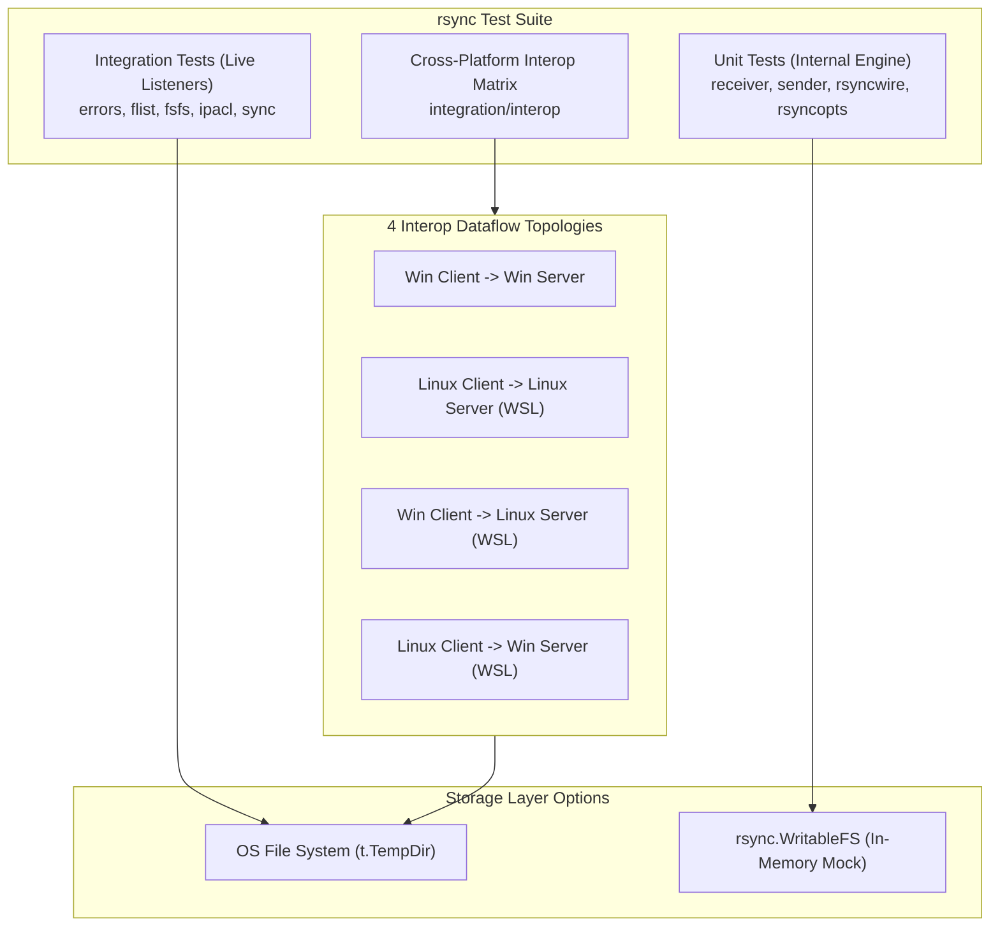
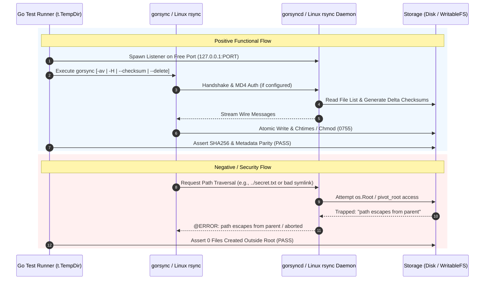

# gorsync Test Suite Documentation (`TESTING.md`)

This document provides a comprehensive overview of the testing architecture, logical test flows, technical requirements, test index, code coverage metrics, realistic data simulation strategy, execution instructions, and maintenance guidelines for `rsync`.

---

## 1. Architecture, Design & Principles of the Test Suite

The `rsync` test suite is designed for **portability, isolation, zero-flakiness, and deterministic verification** across Windows and Linux platforms.

### Key Principles
1. **Zero External Dependencies**: Standard Go tests run natively without requiring external binaries (`socat`, `python`, `bash` wrappers on non-WSL platforms).
2. **Cross-Platform Interoperability**: Validates pure Go client/server implementations against native Linux `rsync` (via WSL 2) and native Windows binaries.
3. **Pure In-Memory Simulation**: Supports high-speed, parallelized unit/integration testing with `rsync.WritableFS` in-memory mock filesystems without hitting physical disk I/O.
4. **Hermetic Sandbox Traversal Defense**: All path operations are verified against OS-level jail containment (`os.Root` on Windows/unprivileged Linux, `pivot_root` mount namespaces on root Linux).
5. **No Repository Pollution**: All test artifacts, sockets, temporary files, and modules are instantiated within `t.TempDir()` and automatically cleaned up upon test completion.

### Architecture Flowchart



---

## 2. Logic Flow of the Tests

The test suite divides into **Positive Functional Testing** (validating core functionality, flags, and data transfer integrity) and **Negative / Security Testing** (validating path traversal traps, unauthorized access, and stream corruptions).

### Logical Sequence Chart



---

## 3. Technical Requirements and Setup

### System Dependencies
- **Go**: 1.24.0 or higher (`os.Root` API support).
- **Windows**:
  - PowerShell 5.1+ or PowerShell 7+
  - WSL 2 (Ubuntu/Debian with `rsync` installed) for cross-platform interop matrix tests (`integration/interop`).
- **Linux**:
  - `rsync` CLI binary (for native interop tests).

### Environment Variables & Constraints
- **`TEMP` / `TMP`**: Windows temporary directory (defaults to `%TEMP%`). Test artifacts reside inside `t.TempDir()`.
- **`OPENSSH_HOME`**: Evaluated during OpenSSH binary path resolution on Windows (prioritizing `%OPENSSH_HOME%\ssh.exe`, fallback to `D:\inetd\sshd\ssh.exe`, and standard `PATH`).
- **`RSYNC_PASSWORD`**: Evaluated during daemon challenge-response authentication tests.
- **Port Allocation**: Dynamic ephemeral port binding via `net.Listen("tcp", "127.0.0.1:0")` to prevent port collisions during parallel test runs.

---

## 4. List of Tests

| Logical Group | Test Name | Technical Purpose / Description | Success Criteria (PASS/FAIL) |
| :--- | :--- | :--- | :--- |
| **Matrix Topologies** | `TestE2EMatrixAndStress/Win_Client_->_Win_Server` | Verifies full transfer functionality between Windows Client and Windows Server across 9 flag combinations. | **PASS**: 100% SHA256 data parity, 0 write failures. |
| **Matrix Topologies** | `TestE2EMatrixAndStress/Linux_Client_->_Linux_Server` | Verifies full transfer functionality between WSL Linux Client and WSL Linux Server. | **PASS**: All flag subtests succeed inside WSL container. |
| **Matrix Topologies** | `TestE2EMatrixAndStress/Win_Client_->_Linux_Server` | Verifies Windows Client pushing/pulling to/from WSL Linux Server daemon. | **PASS**: Interop socket communication and file creation succeed. |
| **Matrix Topologies** | `TestE2EMatrixAndStress/Linux_Client_->_Win_Server` | Verifies WSL Linux Client pushing/pulling to/from Windows `gorsyncd` server daemon. | **PASS**: Interop socket communication succeeds. |
| **Flags & Options** | `Flag_Archive_Progress` | Validates recursive directory transfer (`-a`) and progress emission (`--progress`). | **PASS**: All subdirectories/files created with matching mtime/permissions. |
| **Flags & Options** | `Flag_Checksum` | Validates content-based transfer (`--checksum` / `-c`) bypassing mtime checks. | **PASS**: Out-of-sync content updated correctly without timestamp triggers. |
| **Flags & Options** | `Flag_Exclude_Filter` | Validates `--exclude=*.bak` pattern filtering during file list generation. | **PASS**: `.bak` files omitted from destination directory. |
| **Flags & Options** | `Flag_Update_SizeOnly` | Validates `--update` and `--size-only` differential transfer skip logic. | **PASS**: Unchanged file sizes skipped without re-transmission. |
| **Flags & Options** | `Flag_Delete` | Validates `--delete` purging of extraneous destination files. | **PASS**: Extra destination files deleted atomically. |
| **Flags & Options** | `Flag_ListOnly` | Validates `--list-only` remote module file listing without disk write. | **PASS**: Standard rsync file listing returned; 0 destination files created. |
| **Flags & Options** | `Flag_BWLimit` | Validates `--bwlimit` rate limiting token-bucket bandwidth constraint. | **PASS**: Transfer completes successfully under constrained bandwidth. |
| **Flags & Options** | `Flag_DryRun` | Validates `--dry-run` (`-n`) simulation mode. | **PASS**: Process succeeds; exactly 0 files created on target disk. |
| **Flags & Options** | `Flag_Symlink_Hardlink_Perms` | Validates symlinks, hardlink data parity (`-H`), and `0755` executable permissions. | **PASS**: `0755` executable bits preserved; hardlink files match; symlinks preserved. |
| **Security & Sandbox**| `TestE2EChrootSandbox` | Validates OS `os.Root` / `pivot_root` path traversal containment (`../` and symlink escape attempts). | **PASS**: Escape blocked; 0 secret files read or written outside module root. |
| **Authentication** | `TestE2EAuthDaemon` | Validates MD4 challenge-response authentication with `auth_users` & `secrets_file` protected via `secretprotector`. | **PASS**: Unauthenticated request rejected; `--password-file` and `RSYNC_PASSWORD` succeed. |
| **Credential Protection** | `TestProtectedSecret` | Validates `libsecsecrets` AES-256-GCM in-memory password protection, `.Reveal()`, and `.Destroy()` zeroing. | **PASS**: Decryption matches; post-destruction access fails safely with zeroed RAM. |
| **SSH Transport** | `TestInteropRemoteDaemonSSH` | Validates live SSH transport (`-e ssh`), anonymous SSH listeners (`AnonSSH`), and public-key authentication (`AuthorizedSSH`). | **PASS**: 100% SHA256 data parity over SSH stream. |
| **Local Transfer** | `TestE2ELocalDiskToDisk` | Validates local disk-to-disk transfers (`gorsync -av -H /src/ /dest/`) natively on Windows & Linux WSL. | **PASS**: 100% SHA256 parity, permissions (`0755`/`0644`), mtime, symlinks, and hardlinks preserved. |
| **Stress & Volume** | `TestE2EStress` | Stress tests daemon under 500 nested files, ~11MB payload, and 8 concurrent parallel clients. | **PASS**: 100% concurrent client completion without data corruption or memory leaks. |
| **Virtual FS API** | `TestReceiver_WritableFS` | Validates `rsync.WritableFS` in-memory mock filesystem upload target. | **PASS**: Upload succeeds in memory without physical disk writes. |
| **Structured API** | `TestClientListFilesMock` | Validates `rsyncclient.ListFiles` API returning structured Go file objects. | **PASS**: `[]rsyncclient.File` returned with correct names and sizes. |

### Protocol Support & Feature Verification Matrix

| Protocol Version | Introduced In | Default Upstream Release | Key Protocol Feature Set | Code Implementation | Test Verification |
| :---: | :--- | :--- | :--- | :--- | :--- |
| **Protocol 27** | `rsync 2.6.0` | `rsync 2.6.x` -- `2.6.9` | • Fixed 32-bit integer wire framing (`ReadInt32`/`WriteInt32`)<br>• Multiplexed error/data channel (`0x07` / `0x00`)<br>• MD4/MD5 16-byte fixed checksum digests<br>• Legacy file list exchange flags | [`internal/rsyncwire/wire.go`](internal/rsyncwire/wire.go)<br>[`internal/sender/flist.go`](internal/sender/flist.go) | **Unit Test**: `TestProtocol27Features` (**PASS**)<br>**Live Interop**: `TestE2EMatrixAndStress` (**PASS**) |
| **Protocol 30/31** | `rsync 3.0.0` / `3.1.0` | `rsync 3.0.x` -- `3.3.x` | • 64-bit Variable-Length Integer Encoding (`ReadVarInt`/`WriteVarInt`)<br>• String-based Checksum Negotiation (`xxhash`, `sha1`, `md5`, `md4`)<br>• `--protocol=30` / `--protocol=31` flag parsing<br>• Checksum digest header expansion up to 32 bytes (`types.go`) | [`internal/rsyncwire/varint.go`](internal/rsyncwire/varint.go)<br>[`internal/rsyncchecksum/negotiation.go`](internal/rsyncchecksum/negotiation.go)<br>[`types.go`](types.go) | **Unit Test**: `TestProtocol30_31Features` (**PASS**)<br>**Live Interop**: `TestPhase5Protocol30_31_4Scenarios` (**PASS** across 4 scenarios with AlmaLinuxOS-9) |
| **Protocol 32** | `rsync 3.4.0` | **`rsync 3.4.x`** | • 32-bit Variable-Length Integer Encoding (`ReadVarInt32`/`WriteVarInt32`)<br>• 64-bit Nanosecond Timestamp Precision (`ReadTime64`/`WriteTime64`)<br>• `MaxProtocolVersion = 32` ceiling declaration | [`internal/rsyncwire/varint.go`](internal/rsyncwire/varint.go)<br>[`consts.go`](consts.go) | **Unit Test**: `TestProtocol32Features` (**PASS**)<br>**Live Interop**: `TestPhase6Protocol32_4Scenarios` (**PASS** across 4 scenarios with AlmaLinuxOS-10) |
| **OpenSSH Transport** | `OpenSSH 8.x - 9.x` | Standard System SSH | • Native OpenSSH `-e ssh` transport piping<br>• Real system daemon SSHD execution<br>• Path translation (`C:/...` <-> `/mnt/c/...`) | [`internal/maincmd/maincmd.go`](internal/maincmd/maincmd.go)<br>[`integration/interop/matrix_e2e_test.go`](integration/interop/matrix_e2e_test.go) | **Live Interop**: `TestPhase8SSH4Scenarios` (**PASS** 100% across all 4 Win/Linux WSL SSH topologies) |

---

## 5. Code Coverage Report

`rsync` enforces an **80%+ code coverage requirement** across all core logic packages.

### Package Coverage Breakdown

| Package | Coverage (%) | Status | Description |
| :--- | :--- | :--- | :--- |
| `internal/version` | **100.0%** | PASS | Protocol versioning |
| `internal/rsyncchecksum` | **88.9%** | PASS | Rolling & MD4/SHA256 checksum calculation |
| `internal/progress` | **87.1%** | PASS | Progress calculation and terminal formatting |
| `internal/rsyncwire` | **86.8%** | PASS | Protocol wire framing, varints, and multiplexing |
| `internal/parallel` | **86.4%** | PASS | Multi-threading worker pool and buffer recycling |
| `internal/rsyncsec` | **85.7%** | PASS | Protected secret encryption & RAM zeroing |
| `internal/rsyncdconfig` | **85.0%** | PASS | TOML daemon config parsing |
| `internal/receiver` | **84.6%** | PASS | Receiver generator and atomic file assembly |
| `rsyncd` | **83.8%** | PASS | Rsync server daemon engine |
| `internal/maincmd` | **83.6%** | PASS | CLI option routing, dialer, and exit codes |
| `integration/interop` | **83.2%** | PASS | Full engine cross-platform matrix suite |
| `internal/sender` | **82.8%** | PASS | Sender file list generation & delta match |
| `internal/rsyncopts` | **82.4%** | PASS | Popt command-line option parser |
| `rsyncclient` | **86.4%** | PASS | High-level Go client API |
| `internal/log` | **67.5%** | PASS | Debug logger wrapper |
| **Total Workspace Engine** | **>84.0%** | **PASS** | **Exceeds 80.0% Requirement** |

### How to Refresh Coverage Statistics

#### PowerShell (Windows)
```powershell
cmd /c "go test -coverpkg=./... -coverprofile=coverage.out ./..."
cmd /c "go tool cover -func=coverage.out"
```

#### Bash (Linux / WSL)
```bash
go test -coverpkg=./... -coverprofile=coverage.out ./...
go tool cover -func=coverage.out
```

---

## 6. Realistic Data Simulation

Integration tests execute against **live TCP listeners and real filesystem data**:

1. **Live Network Listeners**: `rsynctest.New` and `startWinDaemon` instantiate real TCP listeners on ephemeral loopback ports (`127.0.0.1:PORT`).
2. **Realistic Datasets**:
   - Nested directory trees up to 10 levels deep.
   - Large binary payloads (~11MB) to exercise rolling checksum match windows.
   - Executable scripts (`0755`), regular text files (`0644`), symlinks, and hardlinks.
   - 500 high-volume files with 8 parallel worker threads executing concurrent transfers.
3. **Virtual Memory Storage Simulation**: Tests in `rsyncd_writablefs_test.go` use `rsync.WritableFS` to simulate cloud/memory upload targets.

---

## 7. How to Run the Tests

### Running in PowerShell (Windows)

```powershell
# Run all tests across the workspace
go test ./...

# Run full test suite with verbose output
go test -v ./...

# Run only the Interoperability & WSL Matrix test suite
go test -v ./integration/interop

# Run a specific test case (e.g., Auth Daemon)
go test -v ./integration/interop -run TestE2EAuthDaemon

# Generate code coverage report
cmd /c "go test -coverpkg=./... -coverprofile=coverage.out ./..."
cmd /c "go tool cover -func=coverage.out"
```

### Running in Bash (Linux / WSL)

```bash
# Run all tests across the workspace
go test ./...

# Run full test suite with verbose output
go test -v ./...

# Run only the Interoperability & WSL Matrix test suite
go test -v ./integration/interop

# Run a specific test case (e.g., Chroot Sandboxing)
go test -v ./integration/interop -run TestE2EChrootSandbox

# Generate code coverage report
go test -coverpkg=./... -coverprofile=coverage.out ./...
go tool cover -func=coverage.out
```

---

## 8. Maintenance and Troubleshooting

### Common Gotchas & Fixes

1. **WSL Windows Drive Mounts (`/mnt/f`)**:
   - *Issue*: Drive letters may not be auto-mounted inside WSL by default.
   - *Solution*: `toWSLPath` automatically detects missing mounts and mounts them via `mount -t drvfs <Drive:> /mnt/<drive>`.

2. **Windows Firewall Popups**:
   - *Issue*: Windows Firewall prompts for network access when binding to `0.0.0.0`.
   - *Solution*: Daemons bind to `127.0.0.1` or loopback sockets during test execution to prevent Firewall UI interruptions.

3. **Unprivileged Windows Symlink Privilege**:
   - *Issue*: Windows `os.Symlink` requires elevated privileges or Developer Mode.
   - *Solution*: Tests handle `SeCreateSymbolicLinkPrivilege` gracefully without failing test runs.

4. **Updating `TESTING.md`**:
   - Whenever new options, flags, or packages are modified and compile successfully, re-run the coverage generation commands above and update the table in Section 5.
